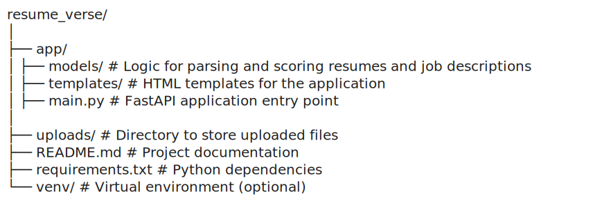

# Resume Verse


A FastAPI-based application for parsing resumes, analyzing job descriptions, and generating interview questions. This project simplifies the resume screening process by automating key tasks like scoring resumes and aligning them with job descriptions.

## Features

- Upload resumes in `PDF`, `DOCX`, or `TXT` formats.
- Parse and extract key information from resumes and job descriptions.
- Summarize resume content.
- Score resumes based on job descriptions.
- Generate interview questions when alignment is sufficient.
- Provides an interactive HTML interface for file upload.

## Installation

### Prerequisites

- Python 3.8 or higher
- Virtual environment setup (recommended)

### Steps

1. Clone the repository:

   ```bash
   git clone <repository-url>
   cd resume_verse
   ```


   Set up a virtual environment:
   
###  start 
    ```bash
            python -m venv venv
            .\venv\Scripts\activate  
            python -m uvicorn main:app --reload
            pip install -r requirements.txt
    ```

    Access the app in your browser at:
        http://127.0.0.1:8000


###  structure 

 


    API Endpoints
    GET /
    Renders the HTML upload form.


    POST /upload
    Uploads and processes a resume and job description.
    Request: Multipart form data with file and job_description.
    Response:
    json
    {
        "summary": "Summarized content of the resume",
        "score": 85,
        "alignment": 90,
        "questions": ["What is your experience with Python?", "Explain your leadership roles."]
    }

    Technologies Used
    FastAPI: Backend framework
    Jinja2: Template rendering
    PyPDF2: PDF parsing
    python-docx: Word document parsing


    Contributing
    Fork the repository.
    Create a new branch (git checkout -b feature-name).
    Commit your changes (git commit -m 'Add feature').
    Push to the branch (git push origin feature-name).
    Create a pull request.
